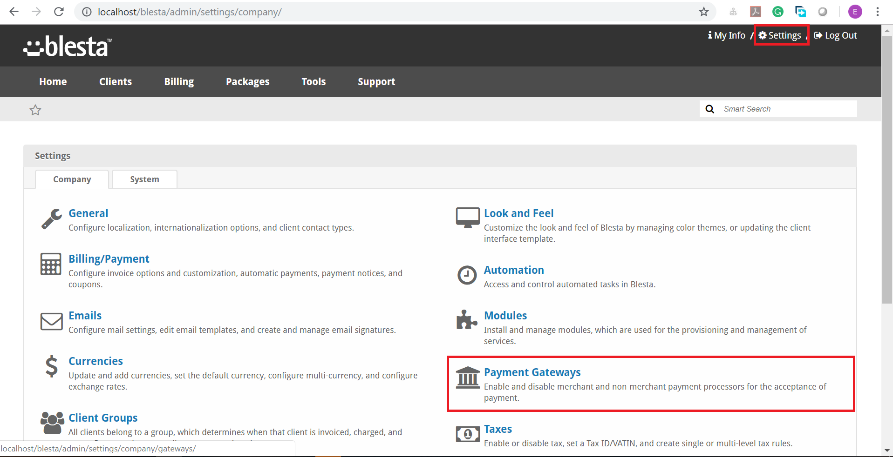
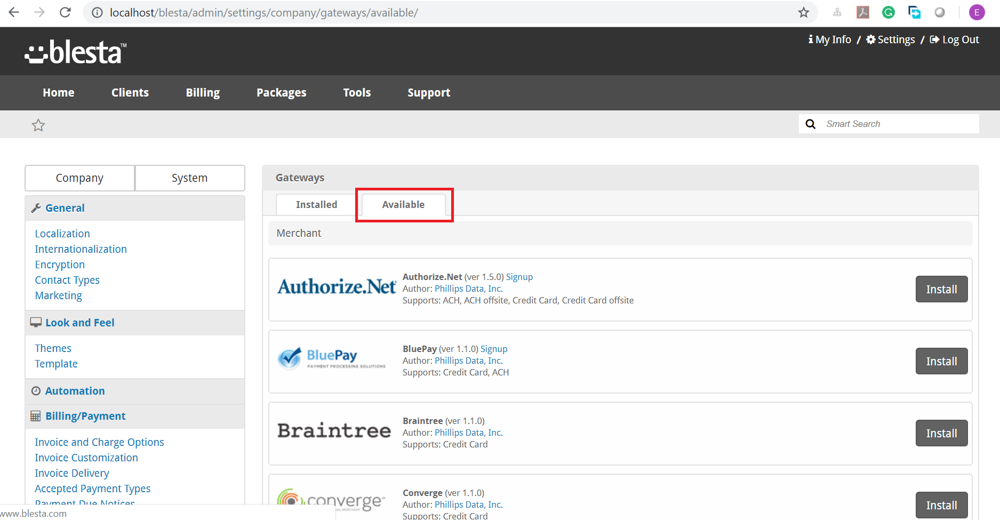
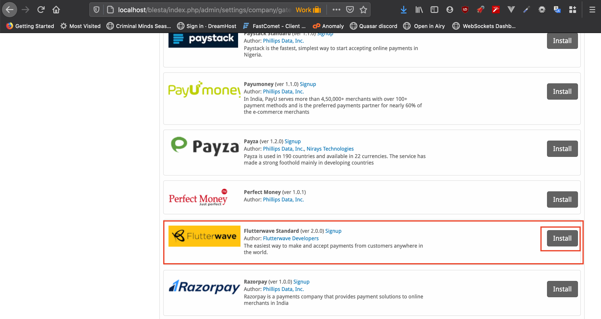
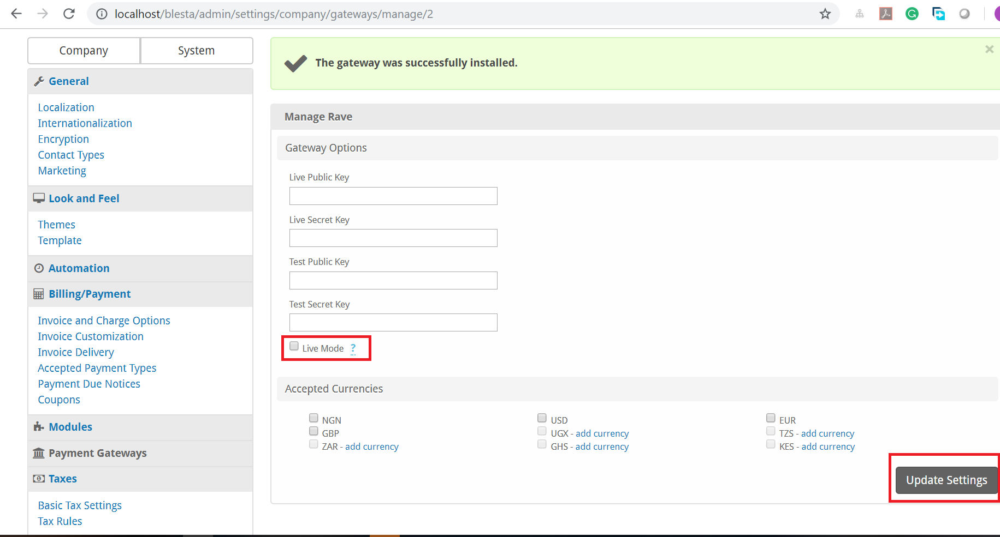

<p align="center">
    
</p>

# Flutterwave Blesta Plugin #

This is a payment Module for Blesta that allows you to accept payments using Flutterwave. Accept Credit card, Debit card, Mobile Money, Pay with Barter and Bank account payment directly on Blesta with the Rave payment gateway. 

Flutterwave is available in: **Nigeria, Ghana, Kenya, Uganda, Rwanda, South Africa, United States** and 90+ Countries. Sign up for an account here

## Getting Started ##

These instructions will get you a copy of the plugin up and running on your local machine for development and production purposes.

### Prerequisites ###

* Blesta installation and setup.
* Flutterwave Account
* PHP 5.2.0 or greater
* Blesta 3.0.0 or greater


### Installing ###

1. Download plugin.

2. Unpack all files from ```blesta-rave-gateway``` plugin, extract the content into ```blesta\components\gateways\nonmerchant``` folder of your Blesta installation and rename the folder to ```rave```.

3. In your Blesta Admin Dashboard, click ```Settings``` on the top right navigation and choose ```Payment Gateways```.

4. Choose **Available** from ```Payment Gateways``` section, it will list all available gateways. 

5. Scroll to ```Rave``` and click on the **Install** button. 


### Configuration ###

Configure your account by filling all the fields. <p></p>

  >Your ```Public and Secret Keys``` can be found in your [Flutterwave dashboard](https://support.flutterwave.com/article/138-my-api-keys). Do not forget to check the checkbox for you are about to go Live.


## Credits ##

 * [Emma Ugo](https://github.com/emmajiugo)
 * [Uchenna](https://github.com/emmajiugo)


## Issues

For issues, suggestions and feature request, [click here](https://github.com/Flutterwave/rave-blesta/issues).
To contribute, fork the repo, add your changes and modifications, then create a pull request.

Copyright (c) 2020, Flutterwave Developers
